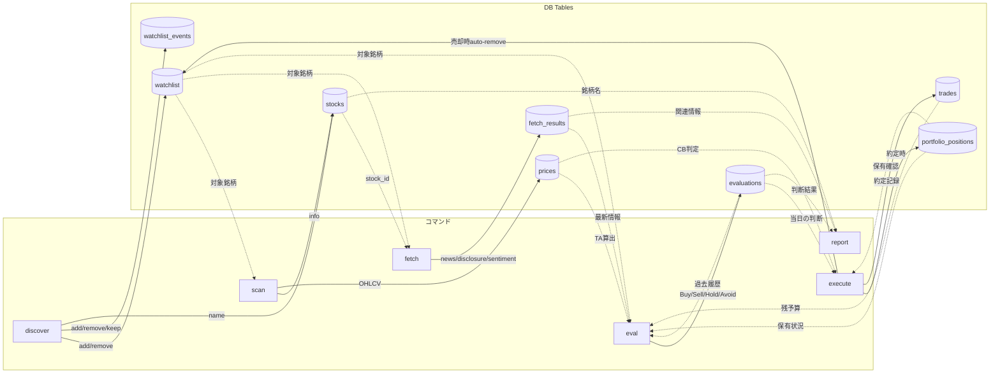

# kekekabu (kabu)

日本株投資のための CLI ツール。LLM を活用した銘柄評価パイプラインを提供します。

## パイプライン

```
discover → scan → fetch → eval → execute → report
```

| コマンド | 概要 |
|---------|------|
| `discover` | LLM で投資 Spec に基づく有望銘柄を発掘し、watchlist を自動管理 |
| `scan` | J-Quants API から価格データを取得し、テクニカル指標（RSI, MACD, BB, SMA 等）を算出 |
| `fetch` | LLM で最新ニュース・開示・センチメント等の情報を収集 |
| `eval` | LLM で投資判断を生成。新規候補は Buy/Avoid、保有中は Hold/Sell |
| `execute` | サーキットブレーカー確認後、売買シグナルを出力 |
| `report` | 評価結果を Markdown レポートとして出力 |

### 判断フロー

```
discover: LLM が watchlist を管理（keep / add / remove）
    ↓
scan: watchlist の銘柄の価格データ + テクニカル指標を取得
    ↓
fetch: watchlist の銘柄の最新情報を収集
    ↓
eval: 銘柄を評価し、売買判断を生成
    │
    ├─ watchlist にある & 未保有 → NewTarget → Buy / Avoid
    ├─ watchlist にある & 保有中 → ExistingHolding → Hold / Sell
    └─ watchlist にない & 保有中 → ExistingHolding → Hold / Sell
    ↓
execute: サーキットブレーカー確認後、売買シグナルを出力
    ↓
report: 評価結果を Markdown レポートに出力
```

> **ポイント**: watchlist から外れても、ポートフォリオに保有がある限り eval の対象になり続けます（Hold/Sell 判断）。watchlist からの除外は売りの直接トリガーではありません。

### データフロー

各コマンドがどのデータを生成（→）し、どのデータを参照（←）するかを示します。



> 実線（→）= 書き込み、点線（-.->）= 読み取り

### 依存関係マトリクス

| コマンド | DB | LLM | 外部 API |
|---------|:--:|:---:|:--------:|
| `scan` | W | - | J-Quants |
| `fetch` | R/W | ✓ | - |
| `eval` | R/W | ✓ | - |
| `execute` | R | - | - |
| `report` | R | - | - |
| `show` | R | - | - |
| `config init` | - | - | - |
| `config validate` | - | - | - |
| `service` | - | - | - |

> R = 読み取り、W = 書き込み、R/W = 両方

## セットアップ

```sh
# ツールのインストール
aqua install

# ビルド
just build

# 設定ファイルの初期化
cargo run -- config init
# → ~/.config/kabu/config.toml と specs/template.toml が生成される

# 設定のバリデーション
cargo run -- config validate
```

`~/.config/kabu/config.toml` を編集して設定してください。

### `[api]` — API キー

| キー | 説明 | 必須 |
|------|------|------|
| `jquants_api_key` | [J-Quants API](https://jpx.gitbook.io/j-quants-ja) のキー。`scan` で価格データ取得に使用 | `scan` 使用時 |
| `anthropic_api_key` | Anthropic API キー。`llm.eval = "api-anthropic"` の場合に使用 | `api-anthropic` 使用時 |
| `gemini_api_key` | Google Gemini API キー。`llm.fetch = "api-gemini"` の場合に使用 | `api-gemini` 使用時 |

環境変数 `JQUANTS_API_KEY`, `ANTHROPIC_API_KEY`, `GEMINI_API_KEY` でも設定可能です（config より優先）。

### `[llm]` — LLM バックエンド

| キー | デフォルト | 説明 |
|------|-----------|------|
| `fetch` | `cli-gemini` | `fetch` コマンドで使う LLM。`cli-gemini` / `cli-claude` / `api-gemini` / `api-anthropic` |
| `eval` | `cli-claude` | `eval` コマンドで使う LLM。同上 |
| `fetch_model` | (なし) | `fetch` で使うモデル名の上書き |
| `eval_model` | (なし) | `eval` で使うモデル名の上書き |

`cli-gemini` / `cli-claude` はそれぞれ `gemini` / `claude` CLI がインストールされている必要があります。

### `[spec]` — 投資戦略

| キー | デフォルト | 説明 |
|------|-----------|------|
| `path` | `specs/template.toml` | 投資戦略ファイルのパス（config ディレクトリからの相対パスまたは絶対パス） |

`kabu config init` で生成される `template.toml` をコピーして独自の戦略ファイルを作成し、ここで指定します。

### 投資 Spec（戦略ファイル）の書き方

投資 Spec は TOML 形式で記述し、`discover` と `eval` の LLM プロンプトにそのまま埋め込まれます。
**必須フィールドは `name` のみ**で、それ以外のセクション構造は自由です。LLM が読んで投資判断の基準にします。

```toml
name = "JP Core Value & Quality"
version = "1.0.0"

[budget]
initial_cash = 300_000                # 初期投資資金（円）

[universe.liquidity]
min_avg_daily_volume_3m = 500_000_000  # 5億円
min_market_cap = 30_000_000_000        # 300億円

[universe.financial]
min_equity_ratio = 40.0
max_debt_to_equity = 1.0

[quantitative.value]
max_pbr = 1.2
max_per = 15.0
min_dividend_yield = 3.0

[quantitative.quality]
min_roe = 8.0
operating_margin_trend = "increasing"

[qualitative]
focus_points = """
1. Capital Efficiency: 東証の改善要請に対する具体的な還元策
2. Competitive Moat: 模倣困難な強み、または高い国内シェア
3. Catalyst: 半年以内に株価を動かすきっかけ
"""

[execution]
max_position_size = 0.05
stop_loss = -0.07
trailing_stop = 0.15
```

- `name`（必須）: 戦略名。ログ表示や識別に使用
- `[budget]` セクションの `initial_cash`（任意）: 初期投資資金（円）。設定すると `discover` / `eval` のプロンプトに残り投資可能額が注入され、予算を考慮した判断が可能に
- それ以外のセクション・キーは自由に定義可能
- TOML ファイル全体がそのまま LLM に渡されるため、コメントも LLM への指示として機能します

`kabu config validate` で TOML 構文と `name` の存在をチェックできます。

### 設定例

```toml
[api]
jquants_api_key = "YOUR_JQUANTS_API_KEY"

[llm]
fetch = "cli-gemini"
eval = "cli-claude"

[spec]
path = "specs/my-strategy.toml"
```

## 使い方

```sh
# 日次パイプライン
kabu discover                        # LLM で有望銘柄を発掘・watchlist 更新
kabu scan --refresh-master --days 60  # 初回は --refresh-master 必須
kabu fetch
kabu eval
kabu execute --dry-run
kabu report -o report.md

# DB 閲覧
kabu show watchlist                  # ウォッチリスト
kabu show events                    # ウォッチリスト変更履歴
kabu show events --ticker 7203      # 銘柄別履歴
kabu show positions                 # 保有ポジション
kabu show evaluations               # 評価履歴
kabu show stocks                    # 登録銘柄一覧
kabu show tables                    # テーブル統計
kabu show summary                   # ポートフォリオサマリー
kabu show trades                    # 取引履歴
```

出力はデフォルトで JSON（stdout）。`--format human` で人間向け表示に切り替え可能。
ログは stderr に出力されるため、パイプラインでの利用に適しています。

## 自動化（launchd）

`kabu service` で macOS の launchd サービスを管理できます。

```sh
# インストール（plist 生成 + ~/Library/LaunchAgents/ に配置）
kabu service install

# サービスの開始 / 停止 / 状態確認
kabu service start
kabu service stop
kabu service status

# アンインストール
kabu service uninstall
```

デフォルトでは毎日 08:00 に `discover → scan → fetch → eval` パイプラインが実行されます。

### 手動実行

```sh
# 週次: 銘柄マスター更新 + フルパイプライン
kabu discover && kabu scan --refresh-master --days 60 && kabu fetch && kabu eval

# 日次: 銘柄発掘 → データ収集 → 評価
kabu discover && kabu scan --days 60 && kabu fetch && kabu eval

# 市場オープン: 実行
kabu execute

# 夕方: レポート生成
kabu report -o ~/reports/$(date +%Y-%m-%d).md
```

## 開発

```sh
aqua install        # ツールインストール（just 等）
just build          # ビルド
just test           # テスト実行
just lint           # Clippy
just ci             # fmt-check + lint + test
just --list         # タスク一覧
```

## 技術スタック

- **言語**: Rust 2024 edition
- **DB**: SQLite（tokio-rusqlite, bundled）
- **API**: J-Quants V2
- **LLM**: Anthropic API / Gemini API / Claude CLI / Gemini CLI
- **テクニカル分析**: rust_ti（RSI, MACD, BB, SMA, EMA, ATR）
- **金額精度**: rust_decimal（TEXT 保存）

## 安全機構

- **サーキットブレーカー**: 個別銘柄 >30% 変動、またはウォッチリストの >50% が >5% 下落した場合に execute をブロック
- **ドライラン**: `execute --dry-run` がデフォルト
- **投資 Spec**: TOML で戦略パラメータを外部管理、SHA256 ハッシュで評価時の Spec を追跡
- **eval 履歴注入**: 直近3件の評価履歴を LLM プロンプトに注入し、売→再買のフリップフロップを抑制
- **売却時 watchlist 自動除外**: ポジション全量売却時に watchlist から自動除外し、再評価ループを防止
